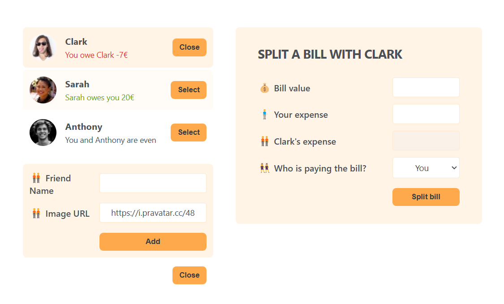

# 🧾 Bill Splitting App  

A simple React application for splitting bills among friends. Easily add friends, enter expenses, and track balances with a clean, user-friendly interface. 🚀  

## ✨ Features  
- ✅ Add friends with profile pictures  
- ✅ Enter bill details and split expenses  
- ✅ Track who owes whom and settle balances  
- ✅ Minimal and intuitive UI for easy bill management  

## 🛠️ Tech Stack  
- **React** – Component-based UI  
- **CSS** – Styled for a clean look  
- **React State Management** – Lifting state up, shared state, and derived state for better data handling  

## 📚 What I Learned  
While building this app, I improved my understanding of **state management** in React, including:  
- **Lifting State Up** – Managing shared data in a common ancestor component.  
- **Shared State** – Synchronizing data between multiple components.  
- **Derived State** – Computing values dynamically instead of storing redundant state.  

## 🚀 Getting Started  

### 1️⃣ Clone the Repository  
```sh  
git clone https://github.com/your-username/splits.git  
cd splits 
```

### 2️⃣ Install Dependencies  
```sh  
npm install  
```

### 3️⃣ Start the App  
```sh  
npm run dev  
```

## 📸 Preview  
  

## 📌 Future Improvements  
- 🔹 Add persistent storage with localStorage or a backend  
- 🔹 Implement different splitting methods (percentage, custom amounts)  
- 🔹 Improve UI with animations and better responsiveness  

## 💡 Feedback & Contributions  
Feel free to open an issue or submit a pull request if you have suggestions! 😊  


